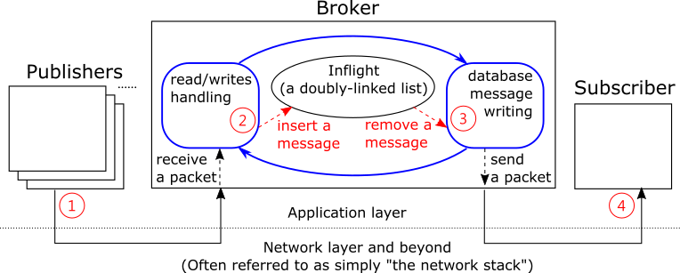
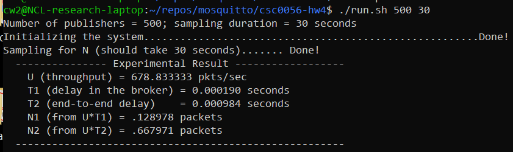

# CSC0056 Homework 4

* Submit your work to Moodle before **9PM, December 12th, Saturday**
* A copy of this instruction can be found [here](https://github.com/wangc86/mosquitto/tree/master/csc0056-hw4).

Table of Contents:

[TOC]

This homework include three parts:

1. Analysis of The Slotted Aloha Protocol (30 points);
2. Literature Reading (30 points);
3. Empirical Study (40 points). 

Things to submit to complete this homework assignment: all those questions/tasks marked in **boldface** in the following (which account for 100 points in total).

## 1. Analysis of The Slotted Aloha Protocol (30 points)

Refer to both pages 279-280 in the textbook and [this lecture note](https://wangc86.github.io/csc0056/1127.pdf). With the *no-buffering assumption* (defined in Assumption 6a in Section 4.6.1 in the textbook), and suppose that $m=3$ and $\lambda=1.5$  packets/second. Answer the following two questions:

1. **(15 points)** What is the average delay for a packet if $q_r=0.2$ ?
2. **(15 points)** Following above, what is the average delay for a packet if $q_r=0.8$ ? 

## 2. Literature Reading (30 points)

To learn recent findings in computer science and engineering, it is very important to read research papers. Throughout the rest of this semester, we will gradually learn some tips to effectively read research papers. For this homework, do the following:

1. Read this short article on "how to read a research paper":

   > *S. Keshav. 2007. How to read a paper.* *SIGCOMM Comput. Commun. Rev.* *37, 3 (July 2007), 83–84. DOI:https://doi.org/10.1145/1273445.1273458*

   From the link above, click the "eReader" or "PDF" to read it. You may need to use the campus network to access this paper.

2. Use the strategy from the above article and read the following research paper. You only need to read the abstract, the introduction, and the concluding remarks: 

   > C. Wang, C. Gill and C. Lu, "Adaptive Data Replication in Real-Time Reliable Edge Computing for Internet of Things," 2020 IEEE/ACM Fifth International Conference on Internet-of-Things Design and Implementation (IoTDI), Sydney, Australia, 2020, pp. 128-134, doi: https://doi.org/10.1109/IoTDI49375.2020.00019.

   Answer these two questions in your own words:

   1. (**10 points**) Describe the research challenge(s) this paper trying to tackle.
   2. (**10 points**) Describe the research contribution(s) this paper claiming to give.
   
3. (**10 points**) Write to let us know where you found it challenging in reading a research paper. Your opinion will help us identify what might help students the most, and they will help us shape materials regarding paper reading in the later part of this semester.

## 3. Empirical Study (40 points)

For this part, we will follow homework 3 and use Mosquitto as our sandbox for empirical valuation.

### 3.1 Setting up customized publishers/subscribers (20 points)

First of all, pull the latest version of [our Mosquitto repository](https://github.com/wangc86/mosquitto). At your mosquitto directory, type

`$ git pull`

which should download everything necessary for this part of the homework.

Now, different from Homework 3, we are going to compile and use our customized mosquitto publishers/subscribers. The code for both publisher and subscriber is located in folder *client*. 

At folder *mosquitto*, type `make` to compile both broker, publisher, and subscriber.

Our compilation will produce a shared library *libmosquitto.so.1* in folder *lib*. This shared library will be used by both our publisher and subscriber at runtime, and we need to make it known by them. We can achieve this by updating our system's environment variable *LD_LIBRARY_PATH* to include the path to the library. This update will only apply to the current user and thus will not mess up the system-wide setting. Type the following to modify your bash configuration:

`$ vim ~/.bashrc`

And the add the following line at the end of the file:

`LD_LIBRARY_PATH=$LD_LIBRARY_PATH:/home/cw2/repos/mosquitto/lib/; export LD_LIBRARY_PATH`

Note that the above should be placed in only one single line.

Save the change and close the file. Then type the following to have our update came into effect:

`$ source ~/.bashrc`

**(20 points) Now run the script named `test-run.sh`. Take a screenshot for the output and upload it to Moodle.** You should see an output similar to file `Screenshot-example.png`.

(The rest of this subsection is optional)

Interestingly, we may send an image using Mosquitto as a "message". To learn more, type `../client/mosquitto_pub --help`  from the homework4 folder. For example, try sending the following image:

(This image is from Wikimedia: https://commons.wikimedia.org/wiki/File:St._Louis_Arch_(1984).jpg. The arch in the photo is the landmark of the dear city where I've sojourned for seven years.)

Here is a helper script for you, named `sendImage.sh`. Run the script and a mosquitto subscriber will receive this image and dump it into a file named `output.jpg` :)

### 3.2 Working with Little's Theorem (20 points)

In this section, we will work with Little's Theorem using Mosquitto. Recall that Little's Theorem states the following relation for a system running in the *steady-state*:
$$
N=\lambda\cdot T
$$
where $N$ is the average number of customers (packets) in the system, $\lambda$ is the average arrival rate, and $T$ is the average time a customer (packet) spent in the system.

In Mosquitto, if we use QoS 0, then we may refer to the following figure as a high-level architecture of the Mosquitto broker:

The broker is single-threaded. Once started, it will keep running a big loop forever (the blue one).

**(TODO: add some more detail here)** 

* Delay in the broker: the time interval between point 2 and point 3

* End-to-end delay: the time interval between point 1 and point 4

If the delay is bound, then the throughput is approximately equal to the arrival rate (assuming that the system does not drop packets), because otherwise the delay will grow as time goes by. Therefore, we may use the throughput along with the delay to estimate the average number of messages in the system.

**(TODO: add some more detail here)** 

Here we wrote a helper script, called `run.sh`, for you to do data communication experiments with Mosquitto. A typical output of the script is as follows. Try it yourself with different number of publishers and sampling duration and see how those might change the result.

Now answer the following questions:

1. **(10 points)** Run script `run.sh` with each of the following configurations:

   1. Number of publishers = 5; sampling duration = 5 seconds
   2. Number of publishers = 5; sampling duration = 30 seconds

   For each case, after the execution, type the following to compute the end-to-end delay :

   `./avg.sh e2e.delay.misleading`

   The output is the average of the end-to-end delay in each case. **Why do we have a longer end-to-end delay when the sampling duration is smaller? In other word, why is the delay dependent with the sampling duration? What lesson(s) did you learn about the experiment design and the parsing of the resulting experimental data?**

   Here are some hints:

   * Observe the content of e2e.delay.misleading;
   * Review the above description of script `run.sh` and think about how would the procedure in the script impact the content of e2e.delay.misleading;
   * There's no need to understand the detail of `run.sh` in order to answer this question;
   * The correct end-to-end delay is shown as T2 in the output of `run.sh`.

2. **(10 points)** For each of the following configuration, **take a screenshot** *and* **plot the result of the N observed by data arrivals**:

   1. Number of publishers = 10; sampling duration = 30 seconds
   2. Number of publishers = 1000; sampling duration = 30 seconds