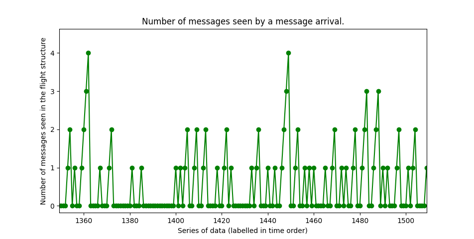

# CSC0056 Homework 4

* (**IMPORTANT: there were mistakes in the [lecture note](https://wangc86.github.io/csc0056/1127.pdf)! Please refer to the latest version, which will be available before class on Dec. 7**)
* Submit your work to Moodle before **9PM, December 12th, Saturday**
* A copy of this instruction can be found [here](https://github.com/wangc86/mosquitto/tree/master/csc0056-hw4).

Table of Contents:

[TOC]

This homework include three parts:

1. Analysis of The Slotted Aloha Protocol (30 points);
2. Literature Reading (30 points);
3. Empirical Study (40 points). 

Things to submit to complete this homework assignment: all those questions/tasks marked in **boldface** in the following (which account for 100 points in total).

## 1. Analysis of The Slotted Aloha Protocol (30 points)

Refer to both pages 279-280 in the textbook and [this lecture note](https://wangc86.github.io/csc0056/1127.pdf) (**IMPORTANT: there were mistakes in the note! Please refer to the latest version, which will be available before class on Dec. 7**). With the *no-buffering assumption* (defined in Assumption 6a in Section 4.6.1 in the textbook), and suppose that $m=3$ and $\lambda=1.5$  packets/second. Answer the following two questions:

1. **(15 points)** What is the average delay for a packet if $q_r=0.2$ ?
2. **(15 points)** Following above, what is the average delay for a packet if $q_r=0.8$ ? 

## 2. Literature Reading (30 points)

To learn recent findings in computer science and engineering, it is very important to read research papers. Throughout the rest of this semester, we will gradually learn some tips to effectively read research papers. For this homework, do the following:

1. Read this short article on "how to read a research paper":

   > *S. Keshav. 2007. How to read a paper.* *SIGCOMM Comput. Commun. Rev.* *37, 3 (July 2007), 83–84. DOI:https://doi.org/10.1145/1273445.1273458*

   From the link above, click the "eReader" or "PDF" to read it. You may need to use the campus network to access this paper.

2. Use the strategy from the above article and read the following research paper. You only need to read the abstract, the introduction, and the concluding remarks: 

   > C. Wang, C. Gill and C. Lu, "Adaptive Data Replication in Real-Time Reliable Edge Computing for Internet of Things," 2020 IEEE/ACM Fifth International Conference on Internet-of-Things Design and Implementation (IoTDI), Sydney, Australia, 2020, pp. 128-134, doi: https://doi.org/10.1109/IoTDI49375.2020.00019.

   Answer these two questions in your own words:

   1. (**10 points**) Describe the research challenge(s) this paper trying to tackle.
   2. (**10 points**) Describe the research contribution(s) this paper claiming to give.
   
3. (**10 points**) Write to let us know where you found it challenging in reading a research paper. Your opinion will help us identify what might help students the most, and they will help us shape materials regarding paper reading in the later part of this semester.

## 3. Empirical Study (40 points)

For this part, we will follow homework 3 and use Mosquitto as our sandbox for empirical valuation.

### 3.1 Setting up customized publishers/subscribers (20 points)

First of all, pull the latest version of [our Mosquitto repository](https://github.com/wangc86/mosquitto). At your mosquitto directory, type

`$ git pull`

which should download everything necessary for this part of the homework.

Now, different from Homework 3, we are going to compile and use our customized mosquitto publishers/subscribers. The code for both publisher and subscriber is located in folder *client*. 

At folder *mosquitto*, type `make` to compile both broker, publisher, and subscriber.

Our compilation will produce a shared library *libmosquitto.so.1* in folder *lib*. This shared library will be used by both our publisher and subscriber at runtime, and we need to make it known by them. We can achieve this by updating our system's environment variable *LD_LIBRARY_PATH* to include the path to the library. This update will only apply to the current user and thus will not mess up the system-wide setting. Type the following to modify your bash configuration:

`$ vim ~/.bashrc`

And the add the following line at the end of the file:

`LD_LIBRARY_PATH=$LD_LIBRARY_PATH:/home/cw2/repos/mosquitto/lib/; export LD_LIBRARY_PATH`

Note that the above should be placed in only one single line.

Save the change and close the file. Then type the following to have our update came into effect:

`$ source ~/.bashrc`

**(20 points) Now run the script named `test-run.sh`. Take a screenshot for the output and upload it to Moodle.** You should see an output similar to file `Screenshot-example.png`.

(The rest of this subsection is optional)

Interestingly, we may send an image using Mosquitto as a "message". To learn more, type `../client/mosquitto_pub --help`  from the homework4 folder. For example, try sending the following image:

(This image is from Wikimedia: https://commons.wikimedia.org/wiki/File:St._Louis_Arch_(1984).jpg. The arch in the photo is the landmark of the dear city where I've sojourned for seven years.)

Here is a helper script for you, named `sendImage.sh`. Run the script and a mosquitto subscriber will receive this image and dump it into a file named `output.jpg` :)

### 3.2 Working with Little's Theorem (20 points)

In this section, we will work with Little's Theorem using Mosquitto. Recall that Little's Theorem states the following relation for a system running in the *steady-state*:
$$
N=\lambda\cdot T
$$
where $N$ is the average number of customers (packets) in the system, $\lambda$ is the average arrival rate, and $T$ is the average time a customer (packet) spent in the system.

In the following, we will first briefly describe the architecture of the Mosquitto broker, and then we will describe where and how to use Little's Theorem for it, and finally there are some experiments and questions for you to 

#### 3.2.1 The Mosquitto broker architecture

For each QoS-0 message, we may refer to the following high-level architecture of the Mosquitto broker:

The broker is single-threaded. Once started, it will keep running the above blue loop forever (This is the `while(run)` loop starting at line 205 in ./src/loop.c). The loop contains a database-write function (line 422 in the same source code), a blocking-poll function for incoming packets (line 475), and a packet-handling function (line 520). By default, in each loop cycle, the blocking-poll function will wait for incoming packets for up to 100 milliseconds. This also prevents the program from consuming all CPU cycles. 

When the handling function in the broker received a message (in the form of a packet), through a series of nested function calls it will append the message to a data structure named "inflight" (line 502 in ./src/database.c), which itself is implemented as a doubly-linked list. In the next cycle of the blue loop mentioned above, the broker will call the database-write function. The function will locate the message from the inflight structure and will send it to its corresponding subscribers, which completes the processing of the message.

#### 3.2.2 Applying Little's Theorem

From the following observations, we may use Little's Theorem to estimate the average number of messages in the broker and in the system:

1. If the delay within a system is bound, then the throughput of the system is approximately equal to the arrival rate of the system (assuming that the system does not drop packets), because otherwise the delay will grow.
2. The delay in the broker is approximately equal to the time a message spent in the inflight structure (the time interval between point 2 and point 3 in the figure above). The end-to-end delay is the time interval between point 1 and point 4.
3. Note that the end-to-end delay will be larger than the delay in the broker for several reasons. First of all, the end-to-end delay includes the time it took to transmit a packet from a publisher to the broker and from the broker to a subscriber. In addition, the end-to-end delay includes the amount of time an arriving packet being buffered in the network stack until the broker takes it.

#### 3.2.3 Experiments and questions

In the homework4 folder you may find a helper script called `run.sh` for you to do data communication experiments with Mosquitto. A typical output of the script is as follows:

Try it yourself to change the number of publishers and/or the sampling duration, and see how that might change the result. Each execution of run.sh will automatically copy some of the results to a subfolder in folder `./result`, and the subfolder is named according to the current clock time.

Take a look at the comments in the script to see the overall procedure. Comments are those lines beginning with a \# symbol. Basically, we first create the broker and the subscriber, and then we gradually create N_PUBS publishers. For each publisher, once it is connected to the broker it will immediately start sending messages to it. To measure the end-to-end delay, we encapsulate a timestamp taken at a publisher as a "message". Upon the arrival of this message, the subscriber take another timestamp and then computer the time difference.  

Now answer the following questions:

1. **(10 points)**  Run script `run.sh` with each of the following configurations:

   1. Number of publishers = 5; sampling duration = 5 seconds
   2. Number of publishers = 5; sampling duration = 30 seconds

   For each case, after the execution, type the following to get a plausible end-to-end delay :

   `./avg.sh e2e.delay.misleading`

   The output is the average of the end-to-end delays collected throughout the experiment.

   * **(5 points)  Take screenshots for both the output of run.sh and the output of `./avg.sh e2e.delay.misleading`, for each configuration. Your result should show that from `./avg.sh e2e.delay.misleading` it seems that the end-to-end delay is shorter if the sampling duration is longer.**

   * **(5 points)  Following the first question, from the output of `./avg.sh e2e.delay.misleading`, why do we have a shorter end-to-end delay when the sampling duration is longer? In other word, how come the delay is dependent with the sampling duration? What can you learn from this regarding the importance of the design of experiment and the parsing of the resulting data?**

   Here are some things to consider:

   * Observe the content of e2e.delay.misleading; in particular, look at the first few lines;
   * Recall that the broker is single-threaded, and that before a publisher can send any message it needs to establish the connection with the broker;
   * With the above two, think about how the order of steps in `run.sh` might impact the content of e2e.delay.misleading;
   * There's no need to understand the detail of `run.sh` in order to answer this question;
   * The correct end-to-end delay is shown as T2 in the output of `run.sh`.

2. **(10 points) ** For each of the following configuration, **take a screenshot** for the output of `run.sh`:

   1. Number of publishers = 5; sampling duration = 30 seconds;
   2. Number of publishers = 500; sampling duration = 30 seconds.

   Comparing the two results, we should observe that although the throughput of the second configuration is 100 times larger, the delays T1 and T2 did not change much. This suggests that the system is still running at a good pace. The additional demands did not add much pressure to the system, and it only caused an increase in N, the average number of messages in the system.

#### Some note

It would be interesting to measure the value of N1 and N2 empirically and compare them to the theoretical values as shown. Unfortunately, it seems that it would take some nontrivial effort to achieve so, and I think that is beyond the reasonable workload for this homework assignment. I was attempted to do this and file `n.log` was for this purpose. The records in `n.log` was taken at point 2 in the broker architecture shown above, for each message arrival. The theory supporting this design is that *Poisson arrival sees the time average* (See Section 3.3.2 in the textbook). But it turned out that simply averaging the records in the output file `n.log` would not give an average anywhere close to one estimated by Little's Theorem, because in our system the timing to do the sampling was *biased*.

When the arrival rate is low, each arrival is very likely to see an "empty" system, since the delay in the broker is so short. You may verify this using only one publisher.

When the arrival rate is high, the buffering in the network stack essentially reshaped the arrival pattern and the resulting pattern is not Poisson. This can be visualized by plotting `n.log` for the configuration of 500 publishers, for example:

The accumulation in time order implies that the broker lags behind in processing incoming packets. The packet-handling function will grab multiple packets from the network stack in the same cycle.

Possibly, to do a less-biased sampling for N, we can add a thread dedicated for sampling. In this way, we may need to protect the related data structure by a mutex.