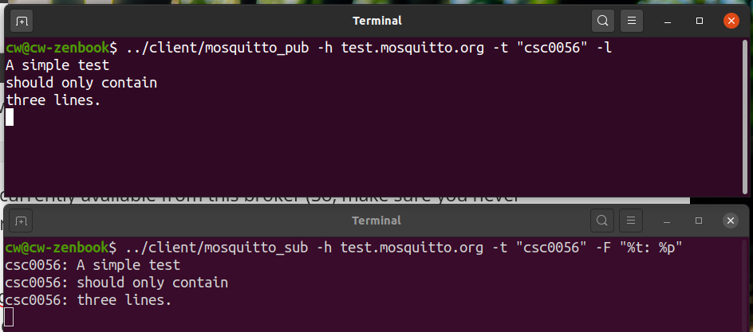
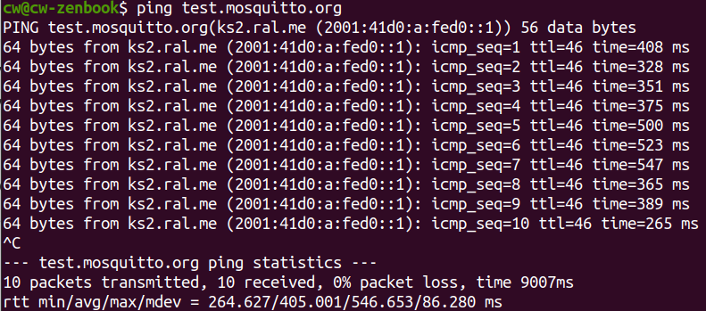

# CSC0056 Homework 5

* Submit your work to Moodle before **9PM, December 28th, Monday**
* A copy of this instruction can be found [here](https://github.com/wangc86/mosquitto/tree/master/csc0056-hw5).

Table of Contents:

[TOC]

## 1. Review of wireless communication (30 points)

Review the course content for lectures on Nov. 30th and Dec. 7th, and answer the following question:

1. **(5 points)**  Illustrate the meaning of *primary interference*.

2. **(5 points)**  Illustrate the meaning of *secondary interference*.

3. **(10 points)**  We know that one may apply the concept of graph coloring and its algorithm(s) to help us construct a collision-free data communication schedule. Describe the connection between graph coloring and collision-free data communication schedule.

4. **(10 points)**  Consider the following two types of collision-free scheduling algorithms:

   * Using the conventional graph-coloring concept, for each wireless link we assign exactly one time slot per cycle.
   * Leveraging the idea that in a graph we may color a vertex with multiple colors, for each wireless link we assign, if admissible, multiple time slots per cycle.

   In general, as we've discussed in class, the second algorithm outperforms the first one in terms of point-to-point data communication latency. In some wireless sensor networks, a piece of data would need to travel through a series of point-to-point communications before it reached the destination. Now, <u>give an example</u> where the second algorithm does *not* outperform the first one, in terms of end-to-end latency. This exercise gives you an idea that some algorithms may be useful only under certain conditions.

## 2. Literature Reading (30 points)

Following homework 4, now read both Sections II and V of the same paper (it may help to also review Section I of the paper):

> C. Wang, C. Gill and C. Lu, "Adaptive Data Replication in Real-Time Reliable Edge Computing for Internet of Things," 2020 IEEE/ACM Fifth International Conference on Internet-of-Things Design and Implementation (IoTDI), Sydney, Australia, 2020, pp. 128-134, doi: https://doi.org/10.1109/IoTDI49375.2020.00019.

Answer the following questions in your own words:

1. (**10 points**) How does Little's Theorem (also called Little's Law) help us in understanding that, in edge computing with a higher workload, the system is more likely to have data losses should the primary IoT gateway fail to work?
2. (**10 points**) Explain why in some application scenarios it is okay to have $L_i > 0$?
3. (**10 points**) Explain why there is no need for data replication if the following two conditions are true:
   * $L_i \geq 1$;
   * The system can ensure that $x_i$($t$) $\leq 1$ at all times.

## 3. Empirical Study (40 points)

Again, we will use Mosquitto as our cloud/edge computing platform. This time, we will use a public Mosquitto broker hosting at [https://test.mosquitto.org/](https://test.mosquitto.org/) . We will see that, different from our previous single-host testing, now the network delay will account for a nontrivial portion of the overall end-to-end delay.

**IMPORTANT**: Try to finish this part of the homework well ahead of the submission deadline, as the public Mosquitto broker may be out-of-service sometimes. Read the caveats on [https://test.mosquitto.org/](https://test.mosquitto.org/) to learn more.

### 3.1 Testing with the public Mosquitto broker (20 points)

IMPORTANT: It is possible that the man pages of Mosquitto on your host is out-dated, and therefore the `man` commands mentioned below may not give all information you need. Two solutions:

1. Upgrade your distribution-versioned package mosquitto-clients: `sudo apt upgrade mosquitto-clients`. This will bring you the latest version available to your Linux distribution.
2. Consult the online manual, which includes all information your need to complete this part of the homework: [https://mosquitto.org/documentation/](https://mosquitto.org/documentation/)

The mentioned Mosquitto broker is publicly available, which means *everyone* on earth can use it to send/receive messages of a certain topic, and *everyone* may see how other people are currently using this broker. For example, you may type the following to subscribe to all topics publicly available on the broker:

`$ mosquitto_sub -h test.mosquitto.org -t "#" -v`

This essentially shows you all the messages currently available from this broker (So, make sure you never send any sensitive information to this broker!). You may type `man mqtt` to learn more about the usage of wildcard \#. 

Now we're going to use this public Mosquitto broker to exchange messages between our publisher and subscriber running on our host. What we're doing is essentially a form of cloud computing, where the Mosquitto broker is a cloud server.

To run our publisher, use the following command as a template:

`$ ../client/mosquitto_pub -h test.mosquitto.org -t "yourTopicName" -l`

Replace "yourTopicName" by your topic name. Try to give an unique topic name; otherwise, you might accidentally receive someone else's message as well as accidentally send your message to someone else! 

The `-l` option tells our publisher that the message is from the stdin, which typically reads the characters you typed. Type `man mosquitto_pub` to learn more.

To run our subscriber, use the following command as a template:

`$ ../client/mosquitto_sub -h test.mosquitto.org -t "yourTopicName" -F "%t: %p"`

The `-F` option tells our subscriber to show a formatted output. Use %t to show the topic name and %p to show the payload. Type `man mosquitto_sub` to learn more.

(**20 points**)  Use the public Mosquitto broker to send/receive messages; take a screenshot to show this. 

The following is an example screenshot:



### 3.2 Measuring the end-to-end latency (20 points)

Now we know how to use the public Mosquitto broker to exchange messages. Typically, we are curious about how long it would take to deliver a message; in other word, we want to measure the end-to-end latency. We use the timing facility provided by Linux and Mosquitto to achieve this.

Here is a command template for our subscriber:

`$ ../client/mosquitto_sub -h test.mosquitto.org -t "yourTopic" -F "%t %p @s @N"`

(**5 points**)  Explain the meaning of @s and @N in the template. The answer is in `man mosquitto_sub`.

And the following is a command template for our publisher:

`$ date +"%s %N" | ../client/mosquitto_pub -h test.mosquitto.org -t "csc0056" -l`

Here we use a [pipe](https://www.geeksforgeeks.org/piping-in-unix-or-linux/) to redirect the output of `date +%s %N` to the stdin read by our publisher. Type `man date` to learn more.

Now, we may again redirect the output of our subscriber to a file:

`$ ../client/mosquitto_sub -h test.mosquitto.org -t "yourTopic" -F "%t %p @s @N" > out.txt `

 and then find the average end-to-end latency. `parse.sh` is a helper script for this purpose. The content of `parse.sh` is explained as below:

```bash
1 #!/bin/bash
2 awk '{if ($5-$3>0) printf "%ld.%ld\n", ($4-$2), ($5-$3); else printf "%ld.%ld\n", ($4-$2-1), (1000000000-$3+$5)}' out.txt > latency.out
3 awk 'BEGIN {sum=0} {sum+=$1} END {print sum/NR}' latency.out
```

The first line tells the system that what follows is a bash script. The second and the third lines are typical awk commands. The second line computes the correct latency information, from file `out.txt` and to file `latency.out`. The third line computes the average of the numbers in file `latency.out` and print to stdout the result, which is essentially the average latency.

(**5 points**)  Upload **your** `out.txt` (**i.e., not the default one; it should be the one you got after you run your mosquitto_sub using the subscriber command given above.**) and show the average end-to-end latency in your experiment. 

You will find that this average end-to-end latency is much larger than what we've seen in the previous homework assignments. One conjecture is that the network delay for traffic to/from the cloud is very long. To investigate this, we may use `ping` to measure the average network round-trip time between your host and the host running the public Mosquitto broker. Type `ping` to learn more. 

(**5 points**)  Use `ping` to measure the average network round-trip time to the broker. Take a screenshot showing the recording of at least 10 packets, and record your result of the average round-trip time (rtt). The following is an example, where the average round-trip time (rtt) is shown at the bottom:



(**5 points**)  Give one reason why there is such a huge discrepancy between the round-trip time and the end-to-end latency. 

