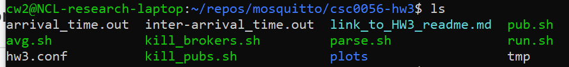
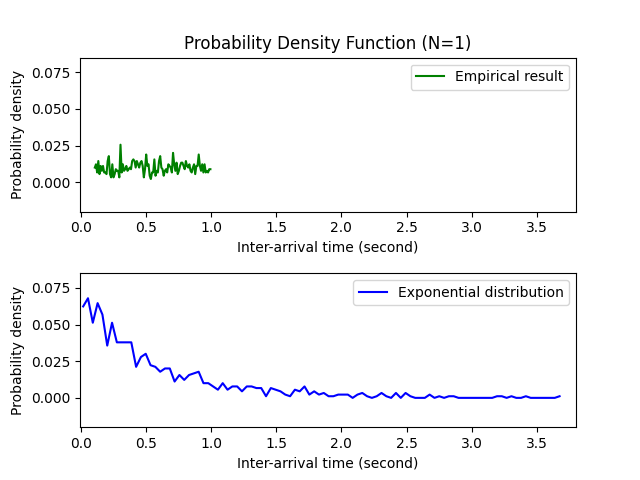
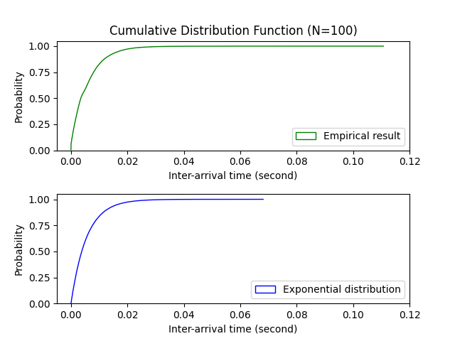

# CSC0056 Homework 3, Part 2

* Submit your answer to Moodle before 9PM, Nov 12th (**Thursday**).

### 1. Poisson process and exponential distribution (20%)

In this part of Homework 3, we will empirically validate the claim we've made in class, that an aggregation of data traffics will often behave as a Poisson process. In particular, we will verify that in data communication, in the presence of many data publishers, the overall inter-arrival times seen at the data broker will follow an exponential distribution.

Warning: start doing this homework early. It may take several hours to setup the needed tools and to get familiar with their usage. It could take another several hours to figure out how to do experiments appropriately and how to make sense of the results.

#### 1.1 Environment setup

On the terminal, type the following in the current directory (i.e., where this readme_hw3 file is) to compile our version of Mosquitto:

`$ make`

If that did not work, see what is the output message and try to fix it. Chances are that you need to install the following four packages:

`$ sudo apt install build-essential libssl-dev xsltproc docbook-xsl`

Then try to `make` again. Now it should work fine to compile the Mosquitto from source. If not, please report what you've seen on the Moodle forum for this course.

In general, it is a good idea to read the official readme.md to learn more. Issues such as above have been documented there: https://github.com/eclipse/mosquitto/blob/master/readme.md 

(<u>Important Note</u>: If you use WSL, make sure you're using WSL version 2. Following [this instruction](https://docs.microsoft.com/en-us/windows/wsl/install-win10) to upgrade to version 2. [Here](https://docs.microsoft.com/en-us/windows/wsl/compare-versions) are some further explanation of difference between the two versions. While working with apt in WSL, if you encounter this error:

> E: Could not read response to hello message from hook [ ! -f /usr/bin/snap ] || /usr/bin/snap advise-snap --from-apt 2>/dev/null || true: Success

you may circumvent this issue by disabling the snap script using the following command:

`$ sudo mv /etc/apt/apt.conf.d/20snapd.conf{,.disabled}`

Learn more at https://github.com/microsoft/WSL/issues/4640 .


#### 1.2 Recording the inter-arrival times seen by the Mosquitto broker

Now change to the folder ./csc0056-hw3. The content of the folder looks like the following:



Here we will use some scripts to help use automatically run experiments. The driving bash script is "run.sh":

```bash
#!/bin/bash

N=1

# Starting the Mosquitto broker
../src/mosquitto -c ./hw3.conf > arrival_time.out &
sleep 2

# Starting publishers
for i in $(seq 1 1 $N); do
    ./pub.sh &
    sleep 0.1
done
echo "Finished starting all publishers"

# Keep collecting data
sleep 500

# Killing all publishers
./kill_pubs.sh

sleep 10

# Killing the broker
./kill_brokers.sh

sleep 2

# Parsing data
./parse.sh
```

This script does the following in sequence:

1. Start a Mosquitto broker listening at port 2005 (set in hw3.conf);
2. Start N Mosquitto publishers (more on this later);
3. Have those N publishers sending data to the broker for 500 seconds;
4. Kill all publishers and the broker;
5. Parse the timing information and compute the inter-arrival times seen by the broker.

Therefore, **the above constructs N data traffic flowing to the Mosquitto broker. For N=1, the inter-arrival times seen by the broker is essentially the inter-publish times of the publisher. As we increase the number of data publishers, we will see that the distribution of inter-arrival times approaches the exponential distribution.**

**In the case of this Homework, the inter-publisher time of a Mosquitto publisher follows a uniform distribution. And by experimenting with the choice of N, you will see the change in the distribution of inter-arrival times.** 

Here is the script for our Mosquitto publisher:

```bash
#!/bin/bash

while true;
do
    mosquitto_pub -t "topic1" -m "msg1" -p 2005 -q 0
    sleep 0.$(( $RANDOM % 99 + 1 ))
done
```

Basically, we keep invoking the `mosquitto_pub` utility, which we have used in Homework 1. It is also possible to use a customized Mosquitto publisher for the same purpose, although we chose not to do so here.

It might be helpful to observe that the inter-publish time of this kind of publisher follows the uniform distribution. Think about what should the p.d.f. and the c.d.f. look like for an uniform distribution. 

Note that for this homework assignment, we do not use our home-made mosquitto_pub. We will use that in the future homework assignment.


#### 1.3 Installing data visualization tools

We are going to visualize the distribution of those inter-arrival times. For this part we will use [NumPy](https://numpy.org/)+[Matplotlib](https://matplotlib.org/) to plot the results. You can also use whichever visualization tools you find useful; in that case you may skip the rest of this subsection and go to Section 1.4 below.

There are many online tutorials showing how to install and use Matplotlib and NumPy. The following are some for your reference. Note that if you're using WSL then you will need to install them in Windows, since WSL does not have graphical interface (You can easily transfer files between WSL and Windows: the Windows C drive folder can be found at /mnt/c in WSL).

It is easy to install Matplotlib and NumPy on Ubuntu. Just following [the official instruction](https://matplotlib.org/users/installing.html) of Matplotlib and the procedure will install NumPy by the way.

In Windows, it seems that the easiest way is to install [Visual Studio + Visual Studio Code](https://visualstudio.microsoft.com/). The community edition is good enough for us. While installing Visual Studio, select Python and those packages for data science and analytics, and it will install Matplotlib and NumPy; if not, now you have the needed development environment and you can follow the official instruction of Matplotlib listed above.

Use [this example](https://matplotlib.org/gallery/lines_bars_and_markers/psd_demo.html#sphx-glr-gallery-lines-bars-and-markers-psd-demo-py) to verify that you have successfully installed everything.


#### 1.4 Experimental steps

Finally, here are the steps you must do to complete this part of the homework:

1. Set N=1 in the script run.sh;
2. execute run.sh, and then use the result to plot both the p.d.f. and c.d.f. for your measured inter-arrival times;
3. Set N=3 and repeat Step 2;
4. Set N=5 and repeat Step 2;
5. Set N=7 and repeat Step 2;
6. Set N=9 and repeat Step 2.

Observe and note that up to which N the empirical result will start to look similar to the exponential distribution. 

Here are some example results. You may find more examples in folder "csc0056-hw3":





To plot the right exponential distribution for comparison, in the exponential function you need to both set the right `scale` parameter and the right `size` parameter. The `scale` parameter is the reciprocal of the rate of the exponential distribution. Think about how to set this value based on the measurements of inter-arrival times, so that we may have a fair comparison between the exponential distribution and the empirical result. Script ./avg.sh can be handy here. Some document to take a look: https://numpy.org/doc/stable/reference/random/generated/numpy.random.Generator.exponential.html?highlight=exponential%20distribution

The `size` parameter should be set equal to the number of measured inter-arrival times.

Note that the plot of exponential distribution will change each time you run the script, because each time its random number generator will use a different seed.

Also, make sure to choose the range of x-axis and/or y-axis to help clarify your comparison. For example, notice that in the c.d.f. figure above I purposefully set the x-axis the same across two results; otherwise, it may not be obvious that the two curves have similar trend. It is easy to set the range of either axis. See lines 14 and 15 in file cdf-n1.py for example.


### 2. Basic code tracing  (20%)

It is very helpful to learn some skills to study a large software project. For example, in Section 1 above, how did we find the right place to insert the instrumenting code for taking timestamps? In this section, we will learn to use some some useful tools to help us study the source code. 

You are welcome to use some other tools you knew to complete this Section (in doing so, be sure to write down a reference to the tool you used). Here, we will use [cscope](http://cscope.sourceforge.net/) to complete the task. Combining with the use of [Vim](https://www.vim.org/), one may use cscope to study the code among files and understand the overall structure.

The teaching assistant has prepared a great tutorial for cscope, along with some examples. Take a look at file "cscope_tutorial.pdf" in the ./csc0056-hw3 directory. We will also have a demonstration in Monday's class. Finally, be sure to go through this official tutorial as well: http://cscope.sourceforge.net/cscope_vim_tutorial.html

**Your job here is to list the series of function calls in order, between "the beginning of the Mosquitto broker" and "the line where we take timestamps for data arrivals."** Essentially, this means to figure out the calling path from the main function in ./src/mosquitto.c to line 253 in ./src/handle_publish.c

The last slide in cscope_tutorial.pdf is a great starting point. There you have an overview of the structure. **Now, you need to give the exact function names and their sequences in the calling path.** Organize your findings clearly, in a way that you yourself will appreciate and find helpful in understanding the code. Optionally, you may draw a flow chart like those examples in cscope_tutorial.pdf

For example, you can organize your finding in a form similar to the following:

```
Document name: our code-tracing log

main(...) in ./src/mosquitto.c,
  at line XXX calls
f1(...) in ./src/another_file.c,
  where at line yyy it calls
f2(...) in ./maybe_another_folder/yet_another_file.c,
  where at line zzz it calls
f3(...) in ...
  ...
  ...
function handle__publish() in ./src/handle_publish.c,
  where at lines 252 and 253 we have inserted our timestamping code.
```


### 3. Conclusion, and things to submit to Moodle

Please submit the following to Moodle:

1. (20%) Five pairs of figures (**both** p.d.f. and c.d.f.) for N=1,3,5,7, and 9. **This means ten figures in total, with one p.d.f. plot and one c.d.f. plot for each value of N, and within each figure there is one subplot for your empirical result and one subplot for the corresponding theoretical curve of an exponential distribution.** Also, based on your results, point out the smallest N where the empirical result  becomes similar to the exponential distribution;
2. (20%) Your result of code tracing, as described above.

We have covered a lot of materials in this homework. Hope this will give you some ideas about how Poisson process appears in data communication. Plus, you've gained some experience in doing both computer systems experiments and code tracing :)


### Some miscellaneous note 

1. For many of the tools we used in this Homework, you may find related tutorials at a MIT online course: https://missing.csail.mit.edu/
2. Here is a great font type to use and to look at on WSL: https://blog.miniasp.com/post/2017/12/06/Microsoft-YaHei-Mono-Chinese-Font-for-Command-Prompt-and-WSL 
3. In Section 1, when running experiments, it would be helpful to use the `top` utility to help you understand the current workload of the system. You may also run "kill_pubs.sh" in ./csc0056-hw3 to help killing some misbehaving Mosquitto publishers.
4. For any questions/suggestions regarding the use of bash scripts, awk scripts, python scripts, and cscope, please do no hesitate to post your comments on the course forum in Moodle. Often, people will have similar questions and we need someone to speak up first.

That's all. Enjoy the experiments :)